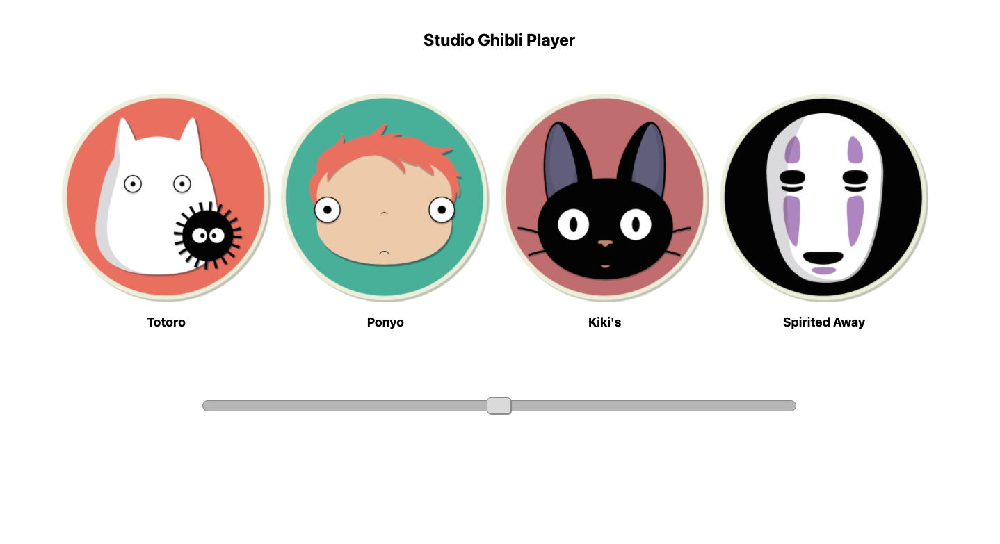

# Studio Ghibli Player
## Mini Project 5 - Shirley Liu

Studio Ghibli Player is a gift for my friends Aryana and Inez that love Studio Ghibli movies.  This extension uses the Chrome Tabs API by creating a new tab on a click of the extension icon. The new tab will be of the Studio Ghibli Player page which consists of four buttons: Totoro, Ponyo, Kiki's Delivery Service, and Spirited Away. You can click on these buttons to pause and play the audio and control the volume with the volume slider on the bottom. I hope my friends will be able to use this extension whenever they want a break from doing work or just whenever they want to listen to music from their favorite movies!

