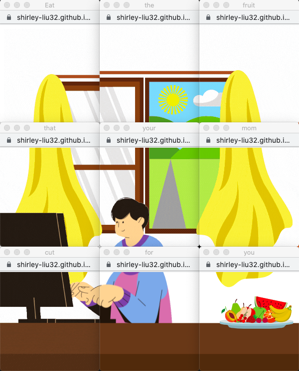
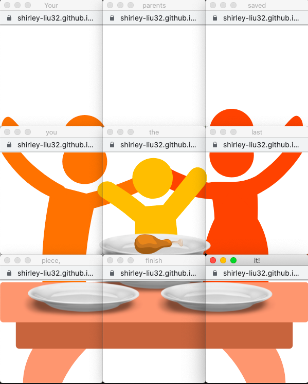
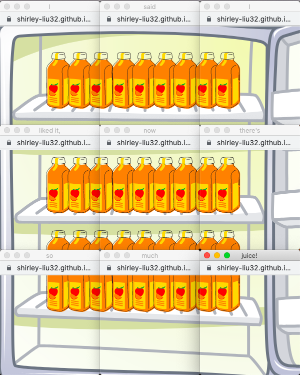
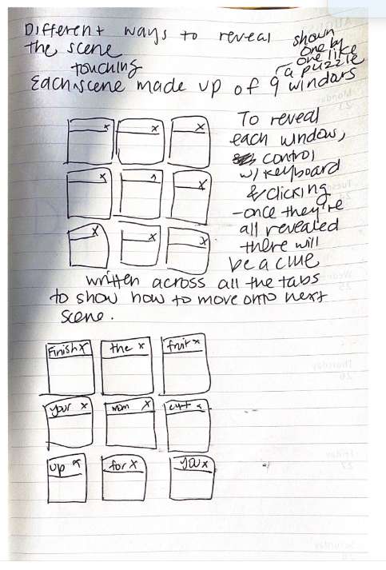

# Project A: I Love You By: Shirley Liu

## Introduction
For this project, we should "challenge our beliefs what a website can be; an object, a place to linger, an experience, a feeling, a story." I Love You is an interactive experience that showcases the little moments in my life that I find heartwarming. The project is made up of three different scenes and each scene is made up of 9 popup windows. The user will look around and try to find out what to do to move on to the next scene and perhaps see the hints hidden in the title tabs.

## Process
One of the most challenging parts of the project is figuring out how to challenge our own minds of what a browser can be. At first, my idea involved creating mini games with clues of how to play in the tab. However, after my meeting with Leon I had realized that the games were already well known and did not have much of a surprising element to it. Thus, I tried to brainstorm a new idea and came up with wanting to talk about how my parents show their love. To keep it from being just a story, I had to think of ways to make it more interactive. Thus, I thought it would be cool to have the scenes made up of nine windows and for each window to be revealed with the user moving their mouse over the window. Once all the windows are laid out, a message will be made across all the tabs. I felt that audio would be a great touch so I added sounds when the user would eat the chicken and fruit and drink the juice. 

I started off with creating the graphics in Canva and then separating them into 9 tiles. Then, I moved onto coding the project and realized that I would be dealing with lots of windows so that was another challenging part to it. However, once I figured out how to create one scene, making the others became easier. One of the challenges I faced was positioning the windows because they were not going to the location I had specified. I kept on trying but then realized the issue was that I used the same variable name. In the end, I was able to create what I had envisioned in my sketches and I would love to continue to further this project with more scenes.

## Conclusion

Overall, I feel that this project was a good exercise to challenge the way I view browsers and I am glad I got the chance to rework my ideas. Next time, I would love to work on making the styles of the scenes match. Additionally, I think changing up the interactions for each scene would make it a little more fun and challenging for the user as they wouldn't know what to expect next.