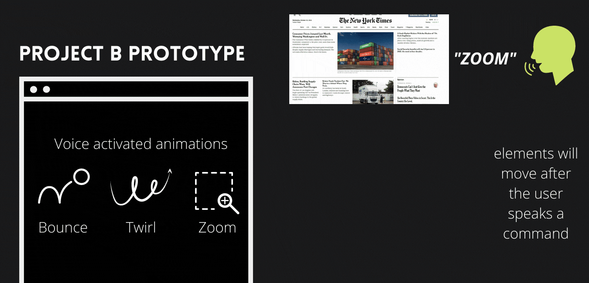

# Project B Prototype
## Voice Activated Animations Extension 

My idea for project B is to create an extension that allows the user to speak to the computer to manipulate different elements on a webpage. By using specific keywords or commands, the user can animate the images and text on any page. For example, if the user were to say "zoom", I was thinking to have all the images zoom in or the whole page zoom. Some other keywords I thought of for the animation was spin, twirl, and bounce. My project aims to create a fun interactive experience by allowing a new type of input, the voice. Instead of clicks and keyboard presses, I thought it would be interesting to have a voice recognition as a main component of the interaction. I plan to use a p5 speech recognition library to identify what the user is saying. Perhaps I will provide the list of key words the user can say or leave it to them to guess what kind of animations there will be in the extension.

I find using voice recognition as the input to be quite fun and I like the idea of having animations but I am also thinking of other ways I can manipulate the elements. Another possiblity is to have the user speak a message and have it replace the text on the page or have the statement the user made covering the entirety of the website like a stamp on the page. As I am thinking about how to build the extension, I feel some of the difficulty will come from asking the user for permission to use their microphone. I think after solving that, we will get the result from the recorder and then we might find it a little challenging to manipulate the page based on what the user has said.