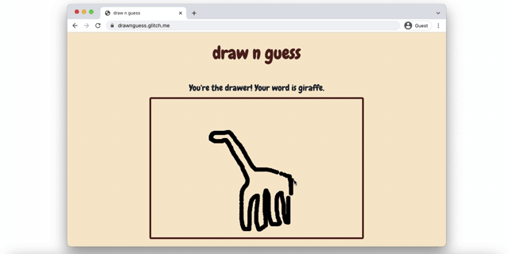
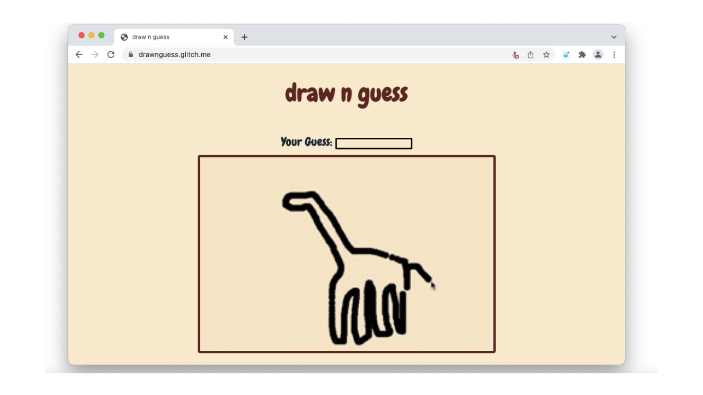

# Draw N Guess Game
## Project C - Shirley Liu

### Overview
Need a new online game to play with your friends when you're bored? Introducing Draw N Guess, a multiplayer word guessing game involving a drawer and guessers. When you are the drawer, you are given a random word from our extremely huge 'database' and then you will draw it out for the guessers to see. 



Once the guessers see what you are drawing, they will try to guess the object to become the drawer.



Extremely fun way to get competitive with your friends and family while making funky looking drawings!! So, why don't you give it a try by checking it out [here.](https://drawnguess.glitch.me/)

### How It Works
This game was created using Express.js, jQuery, and Socket.io. As people enter the game, the server will check who is the first user and will make that person the drawer. Everyone who joins afterwards would then automatically become the guessers. We will keep track of the type of user using a boolean, true for the drawer and false for the guesser. As more people join, the number of people in the game will be emitted to all users. Guessers will type in what they think the random word is and then can press the enter key to submit and check if it's correct through the onKeyDown function.
```
  let onKeyDown = function(event) {
        if (event.keyCode != 13) { // Enter
            return;
        }

        if (userType === false) {
            initialGuess = guessBox.val();

            socket.emit('guessToServer', { guess: guessBox.val() });

            guessBox.val('');
        }

    };
```
 When someone guesses the random word the drawer was given, then the guesser will have their canvas cleared and become the new drawer. This is done by emitting an object to all clients including the client that emitted. However, if the client guesses wrong than the guessToServer listener will be broadcasted and you keep guessing. 
 ```
 if (information.guess === initialGuess) {
            userType = true;
            drawerReset();
            context.clearRect(0, 0, canvas[0].width, canvas[0].height);
            socket.emit('clientToServerWordCheck', { drawer: userType, word: randomWord });
 ```
 Additionally, if the drawer leaves, a new game will start and the first guesser will become the drawer with a new random word. To start drawing on the canvas, I used a boolean to check for the mousedown event. So, if the the user type is true, meaning they are the drawer and the mouse is down, then we can draw on the canvas using the draw function. The draw function creates arc's with the user's previous and current positions which can be determined when the user clicks down and lets go. 
 ```
  let draw = function(position) {
        context.beginPath();

        context.arc(position.x, position.y,
            6, 0, 2 * Math.PI);
        context.fill();
    };

 ```
 My word list are objects that can be found [here.](https://github.com/dariusk/corpora/blob/master/data/objects/objects.json) 

 ### Conclusion

Overall, it was great to see how much fun people were having doodling and trying to guess what others were drawing. In the future, I will like to improve the technicality of the game as there are moments where the drawer cannot guess after their word was guessed by other players. To further develop the game into something that doesn't seem as isolated, I would emit all the guesses players are making and by who exactly. Addtionally, adding who is the drawer at the moment would it make more clear to the other players everyone's roles in the game. I believe adding these features would go a long way in making the experience more fluid especially when there can be unexpected difficulties with server capabilities. All in all, it was fun to see everyone interact with each other through drawing and guessing interesting looking doodles :)